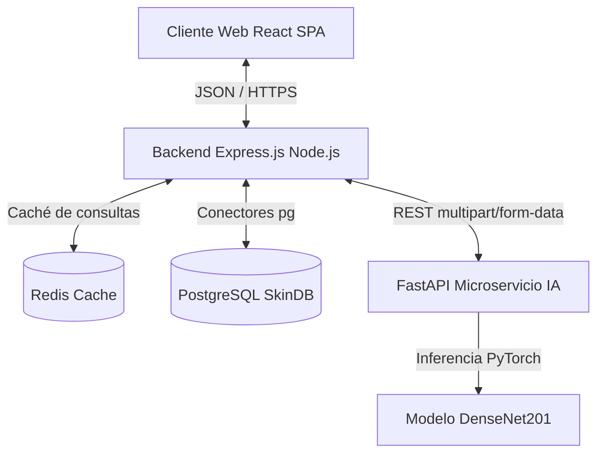
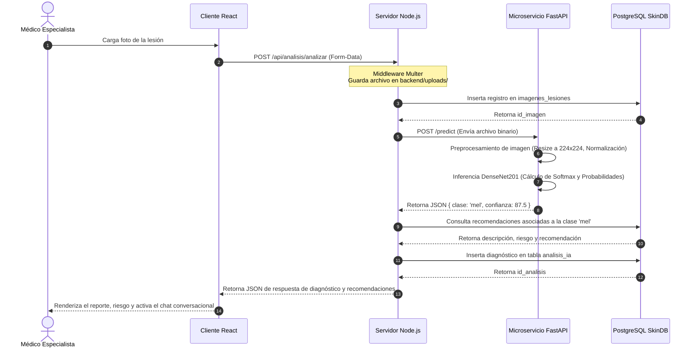

# Documento de Descripción de Diseño de Software (SDD) - v1.0

## 1. Arquitectura General del Sistema

SkinCancerApp está compuesta por tres servicios desacoplados que interactúan de manera asíncrona y RESTful. El almacenamiento físico se centraliza en PostgreSQL (`SkinDB`), la caché temporal en Redis, y la computación pesada de Machine Learning en un microservicio de Python independiente.

---

## 2. Desglose del Backend MVC (Node.js + Express)

El backend de Node.js está estructurado bajo el patrón de diseño clásico **Modelo-Vista-Controlador (MVC)**, asegurando que la lógica de negocio, los modelos de datos relacionales y el enrutamiento HTTP estén aislados.

### 📁 Estructura del Servidor Express:
- `server.js`: Punto de inicio del servidor Node.js.
- `app.js`: Configuración de middlewares globales (CORS, JSON Parser, Multer para cargas de archivos) y registro de enrutadores.
- `src/config/`: Conectores a la base de datos PostgreSQL (`db.js`) y Redis.
- `src/routes/`: Enrutadores de endpoints REST (`authRoutes.js`, `analisisRoutes.js`, `chatRoutes.js`, `usuarioRoutes.js`).
- `src/controllers/`: Controladores de peticiones que implementan la lógica de validación de negocio.
- `src/models/`: Clases de persistencia y consultas SQL nativas (`Usuario.js`, `ImagenLesion.js`, `Recomendacion.js`, `AnalisisIA.js`, `ChatHistorial.js`).
- `src/middlewares/`: Filtros interceptores (como `authMiddleware.js` encargado de verificar el token JWT).
- `src/services/`: Capa opcional para servicios externos (comunicaciones HTTP con microservicio de IA).

---

## 3. Desglose del Microservicio de IA (FastAPI)

Un servidor Python basado en **FastAPI** corre de forma aislada para ejecutar de forma óptima el modelo PyTorch.
- **Ruta de Inferencia (`ia_service/main.py`):** Expone el endpoint POST `/predict` que recibe la imagen, la convierte a un tensor y ejecuta el modelo.
- **Carga de Red (`ia_service/modelo.py`):** Carga los pesos del archivo `densenet201_ham10000_entrenado.pt` una sola vez en el arranque de la API (evitando recargar archivos de 80MB por cada petición) y prepara la tubería de transformaciones ImageNet.

---

## 4. Diagrama de Secuencia del Análisis de Lesiones

El siguiente diagrama muestra el flujo de datos desde que el médico sube una imagen de lesión cutánea hasta que se guarda el diagnóstico y se le asocian recomendaciones:

